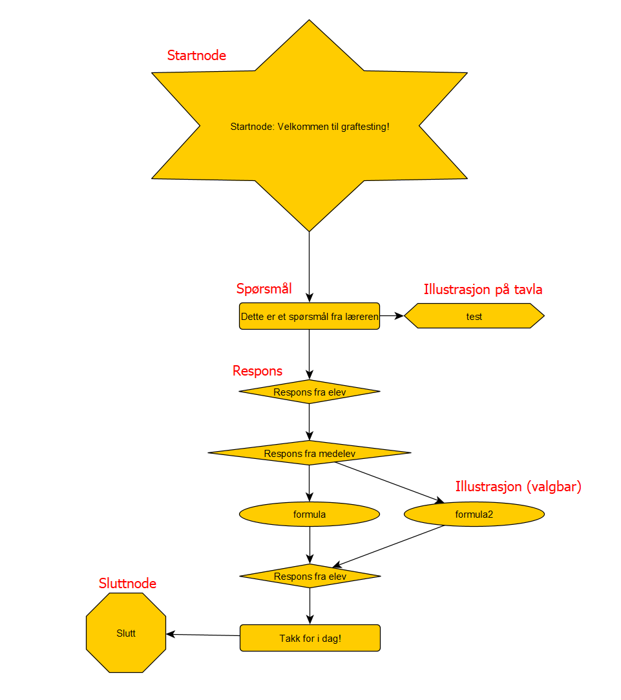

# Brukerguide

Grafene som WeBabble bygger på krever visse typer noder i GraphML-strukturen. Denne seksjonen tar for seg hvilke figurer (shapes) som brukes.

## Start og Slutt
En start-node og en slutt-node er påkrevd i alle samtalegrafer.

### Start
Figur: "star" (stjerne)

Alternative figurer:
- "star5" (fem-kantet stjerne)
- "star6" (seks-kantet stjerne)
- "star8" (åttekantet stjerne)

### Slutt
Figur: "octagon" (åttekant)

Denne figuren signaliserer at samtalen er over.

## Samtale
For en samtale benyttes tre figurer - en for spørsmål (brukerens valg), en for illustrasjoner (valgbare av brukeren), samt en for svar (respons fra en elev).

#### Spørsmål (valg for brukeren av applikasjonen)
Figur: "roundrectangle" (rundt rektangel)

Denne figuren representerer et spørsmål eller utsagn fra brukeren.

#### Illustrasjoner (valgbare)
Figur: "ellipse" (oval)

Denne figuren vil fremvises som et valg for brukeren, som da kan benyttes som et alternativ til rene "tekst"-spørsmål
Når brukeren klikker på en valgbar illustrasjon, vil den bli fremvist på tavla.

#### Svar (respons fra en elev)
Figur: "diamond" (diamant)

Denne figuren representerer svar fra en elev.

## Illustrasjoner
Vi har to typer illustrasjoner - en som linkes direkte til et spørsmål eller svar, samt en som kan velges av brukeren som et alternativ til spørsmål.

### Hvordan lenke til et bilde
For å legge inn en illustrasjon som skal vises på tavla, har du to muligheter:

#### Opplastning av bilde direkte i applikasjonen

For å laste opp et bilde i applikasjonen, gjør følgende:
1. Naviger til `/upload/illustration` (f.eks. http://iluweb01.it.ntnu.no/upload/illustration)
2. Gi bildet et navn:
  - Navnet må være unikt, maksimalt 48 tegn, og kun bestå av alfanumeriske tegn samt `_` og `-`
  - Dette navnet brukes i grafen når du skal referere til et internt bilde
3. Legg inn en beskrivelse
4. Velg bildet du ønsker å laste opp, og klikk "Last opp" for å fullføre

For å bruke det nyopplastede bildet i en graf trenger du kun å referere til navnet du valgte i steg 1. ovenfor.
Om du for eksempel valgte navnet "minformel", bruker du da "minformel" som *label* for en illustrasjonsnode i grafen.

#### Direktelenke til et bilde du har funnet på nett
> Merk: Av sikkerhetshensyn har dette en begrensning, hvor domenet et bilde serveres fra må hvitelistes før det kan benyttes.

Dersom du ønsker å bruke et bilde fra en ekstern tjener (f.eks. Google) bruker du hele nettadressen til bildet som *label* for en illustrasjonsnode i grafen.

### Valgbare
For valgbare illustrasjoner, se [Illustrasjoner (valgbare)](#illustrasjoner-valgbare)

### Standard
Figur: "hexagon"

*Standard* illustrasjoner er illustrasjoner som lenkes til et spørsmål eller svar, som igjen vil bli fremvist på tavla i sammenheng med det relaterte spørsmålet/svaret. Disse kan ikke velges av brukeren.

## Eksempel på en enkel graf

- [Se GraphML-fila her](./example_graph.graphml)

